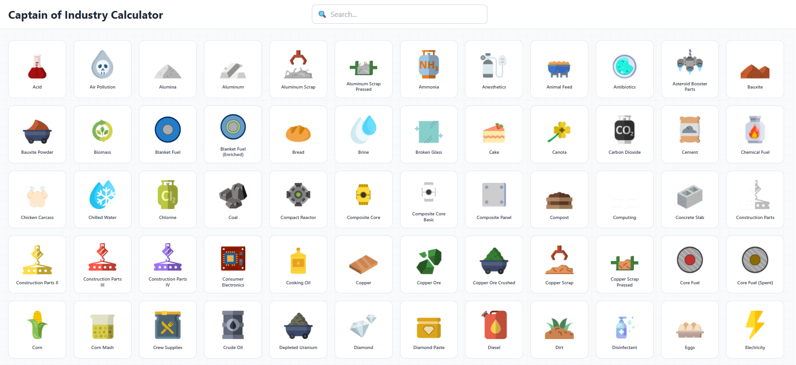
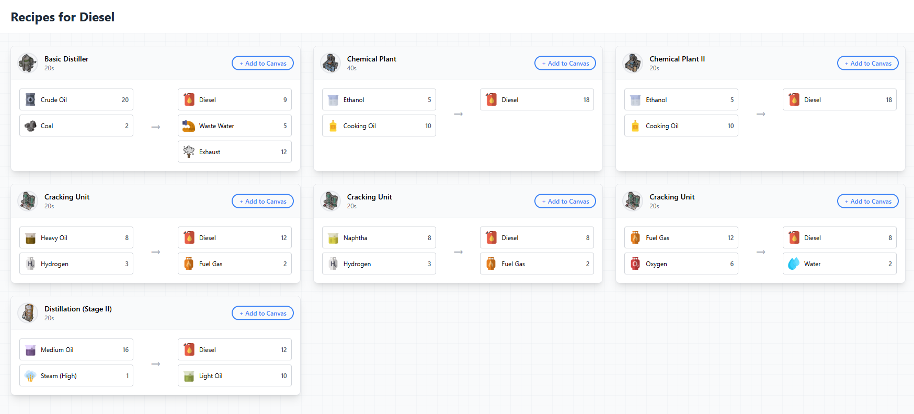
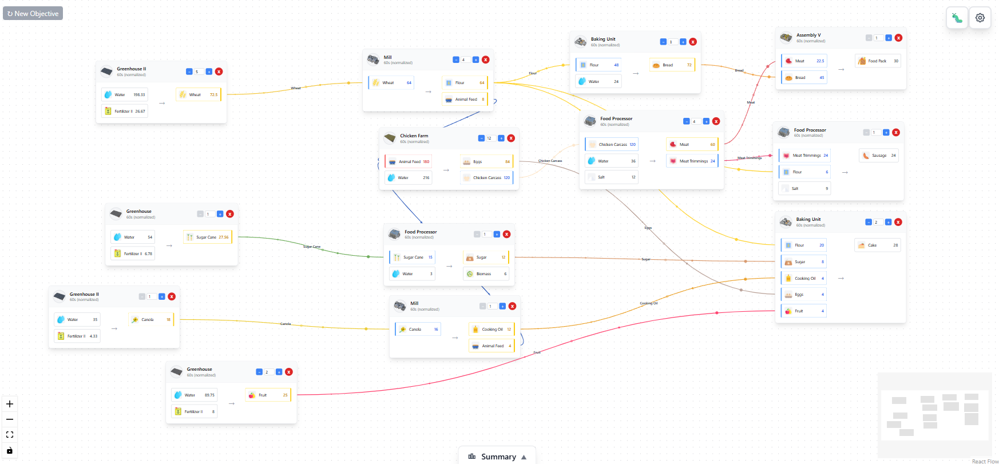
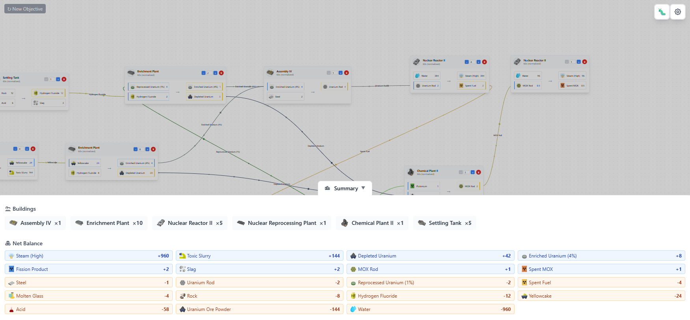
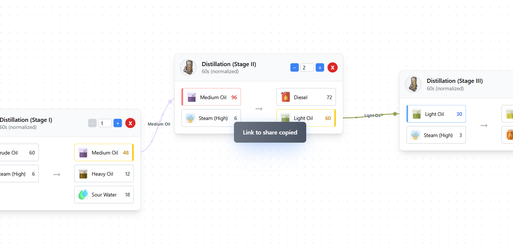

# 🏭 COI Calculator - Captain of Industry Factory Planner

**The ultimate production chain calculator and factory planner for Captain of Industry**

Transform complex factory planning into simple drag-and-drop fun! No more spreadsheets, no more guesswork - just pure factory optimization magic ✨

🎮 **[➤ Start Planning Your Factory Now!](https://fredppm.github.io/coi-calc)** 🎮

[](https://github.com/fredppm/coi-calc/stargazers)
[](https://github.com/fredppm/coi-calc/network/members)


---

## 🌟 What is COI Calculator?

Planning a factory in **Captain of Industry** can be overwhelming. How many iron mines do you need? Which recipes should you use? What buildings are required?

COI Calculator makes it simple:

✅ **Just click what you want to make** - Choose from 220+ resources  
✅ **Drag and drop recipes** - No complex setup needed  
✅ **See everything at once** - Buildings, resources, and connections  
✅ **Share with friends** - Send a link to get help or show off  

**Think of it as drawing your factory on paper, but smarter!** 📝

### 🔍 **Perfect for:**
- **Factory optimization** and production line balancing
- **Supply chain planning** and resource management  
- **Building placement** and layout design
- **Recipe comparison** and efficiency analysis
- **Multiplayer coordination** and factory sharing
- **Learning Captain of Industry** mechanics and recipes

### 🎯 **Keywords:** 
`captain of industry` `factory planner` `production calculator` `supply chain` `resource calculator` `manufacturing` `logistics` `industrial game` `city builder` `factory optimization` `production chain` `building calculator`

---

## 🎮 Try It Now!

**👉 [Open COI Calculator](https://fredppm.github.io/coi-calc) 👈**  
*(We're working together to get this live on GitHub Pages!)*

No download, no installation - just click and start planning! Works on any device with a web browser.

---

## 📸 See It in Action

### 🎯 **Choose Your Goal**
Pick what you want to produce - from simple bread to complex microchips!


*Choose your production goal from 220+ resources*

### 🔧 **Pick Your Recipe**
Select how you want to make it - different recipes need different buildings and resources.


*Browse recipes with clear input/output information*

### 🏗️ **Build Your Factory**
Drag recipes around, connect them together, and watch the magic happen!


*Drag and drop to build your production chain*

### 📊 **Analyze Your Design**
See exactly what buildings you need and which resources you'll have extra.


*Smart analysis shows building requirements and resource balance*

### 🔗 **Share Your Creation**
Copy the link and share your factory design with friends!


*Share designs with automatically compressed URLs*

---

## 🚀 Quick Start Guide

### For Non-Technical Users (Recommended)

**Just want to use the calculator?** We've got you covered!

1. **🌐 Visit the Online Version**: [github.io/coi-calc](https://your-username.github.io/coi-calc)
   - No installation needed
   - Works on any device
   - Always up-to-date
   - *(Working together to deploy this on GitHub Pages!)*

2. **📱 Add to Home Screen** (Mobile):
   - Open the link on your phone
   - Tap "Add to Home Screen"
   - Use it like a native app!

### For Developers or Local Use

Want to run it on your computer or make changes?

```bash
# Download and run locally
git clone https://github.com/your-username/coi-calc.git
cd coi-calc
npm install
npm run dev
```

Open [http://localhost:3000](http://localhost:3000) and you're ready to go!

---

## 🎮 How to Use COI Calculator

### Step 1: **Choose What You Want to Make** 🎯

1. Look at the left panel - you'll see resource categories
2. Click on a category (like "Food" or "Electronics")
3. Pick the resource you want to produce
4. The calculator will show you available recipes

**Tip**: Start simple! Try making "Bread" or "Steel" first.

### Step 2: **Pick Your Recipe** 📋

1. You'll see recipe cards showing:
   - What building you need (with picture!)
   - What resources go in (inputs)
   - What you get out (outputs)
   - How long it takes

2. Click the recipe you want to use
3. A new node appears on the canvas - that's your factory building!

### Step 3: **Build the Chain** 🔗

1. See those red dots on your recipe? Those are inputs you need
2. Click on a red dot to add a supplier recipe
3. Keep clicking to build your entire production chain
4. Drag the boxes around to organize them nicely

**Tip**: Follow the red dots to see what you need to make first!

### Step 4: **Make It Bigger** 📈

1. See the "+/-" buttons on each recipe box?
2. Click "+" to make more of something
3. Click "-" to make less
4. Watch the numbers update automatically!

### Step 5: **Check Your Factory** 📊

1. Click the "Production Summary" button at the bottom
2. See exactly how many buildings you need
3. Check if you have extra resources (green) or need more (red)
4. Adjust your multipliers to balance everything

### Step 6: **Share Your Design** 🔗

1. Copy the URL from your browser
2. Send it to friends or paste it in Discord/forums
3. Anyone can view and modify your design
4. The link contains your entire factory!

---

## 💡 Tips & Tricks

### 🎯 **Getting Started**
- **Start small**: Try making simple things like "Iron Plate" first
- **Follow the dots**: Red dots = need supplier, Green dots = can supply others
- **Use the summary**: The bottom panel tells you everything you need

### 🔧 **Building Efficiently**
- **Check alternatives**: Some resources have multiple recipes - pick the best one!
- **Balance production**: Use multipliers to avoid waste
- **Plan ahead**: Think about what buildings you already have in-game

### 📱 **Sharing & Collaboration**
- **Copy early, copy often**: URLs contain your entire design
- **Ask for help**: Share links in the COI community for feedback
- **Learn from others**: Explore shared designs to get ideas

---

## 🤝 Community & Support

### 🌟 **We're Here to Help!**

**New to Captain of Industry?** Don't worry! This calculator is designed to help you learn.

**Found a problem?** We want to fix it!

**Have an idea?** We'd love to hear it!

### 💬 **Get in Touch**

- 🐛 **Something broken?**: [Report it here](https://github.com/your-username/coi-calc/issues)
- 💡 **Got an idea?**: [Share it here](https://github.com/your-username/coi-calc/discussions)
- 🗨️ **General questions**: Join our community discussions
- ⭐ **Like the calculator?**: Give us a star on GitHub!

### 🤗 **Want to Help?**

Even if you're not a programmer, you can help make COI Calculator better:

- **Test new features**: Try things out and tell us what works
- **Suggest improvements**: What would make it easier to use?
- **Share with friends**: More users = better feedback = better calculator
- **Report bugs**: If something doesn't work, let us know!

---

## 📊 What's Inside

### 🎯 **Complete Game Data**
- **332 recipes** from Captain of Industry
- **220 resources** with beautiful icons
- **147 buildings** with accurate information
- **90%+ image coverage** - see what everything looks like!

### ⚡ **Smart Features**
- **Real-time calculations** - numbers update instantly
- **Automatic balancing** - see resource flows
- **URL sharing** - designs are 80% smaller than they could be
- **Works everywhere** - phone, tablet, computer

### 🔄 **Always Up-to-Date**
This calculator is hosted on **GitHub Pages**, which means:
- ✅ **Always available** - 99.9% uptime
- ✅ **Fast loading** - served from CDN
- ✅ **Automatic updates** - new features appear automatically
- ✅ **No ads or tracking** - just the calculator

---

## 🗺️ What's Coming Next?

### 🎯 **Soon**
- [ ] **Recipe search** - Find recipes faster
- [ ] **Mobile improvements** - Better phone experience
- [ ] **Save designs** - Keep your favorite factories
- [ ] **More images** - Even better visual coverage

### 🔮 **Future Dreams**
- [ ] **Export to game** - Generate actual blueprints
- [ ] **Multiple factories** - Plan complex supply chains
- [ ] **AI suggestions** - Get optimization tips
- [ ] **Team planning** - Collaborate in real-time

---

## 📄 For Developers & Contributors

> **Want to help or run your own version?** Check out our technical docs:
> - 🤝 **[CONTRIBUTING.md](./CONTRIBUTING.md)** - How to contribute  
> - 📸 **[SCREENSHOTS.md](./SCREENSHOTS.md)** - Taking screenshots for documentation

### 🛠️ **Built With**
- **Frontend**: Next.js 14 with TypeScript
- **Visualization**: ReactFlow for the interactive canvas  
- **Styling**: Tailwind CSS for beautiful design
- **Hosting**: GitHub Pages (free, fast, reliable!)
- **Data**: Static files for lightning-fast loading

---

## 🙏 Special Thanks

### 💝 **Captain of Industry Team**
This calculator uses game data from **Captain of Industry**. All game assets and data belong to **Marek Bureš** and the development team. COI Calculator is a fan-made tool created with love for the community.

### 🌟 **Community**
Special thanks to everyone who:
- Tests new features and reports bugs
- Suggests improvements and new ideas
- Shares designs and helps others
- Spreads the word about the calculator

---

## 📄 License

This project is **free and open source** under the MIT License. You can use it, modify it, and share it however you want!

Game assets remain the property of their owners.

---

**Built with ❤️ for the Captain of Industry community** 

*Ready to build the perfect factory? [Start planning now!](https://your-username.github.io/coi-calc) 🏭✨* 